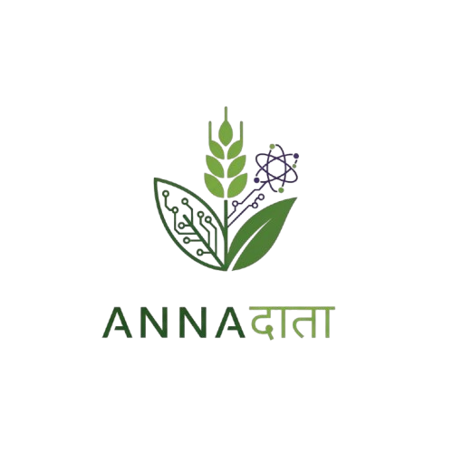

<table>
  <tr>
    <td></td>
    <td>
      <h1>Annadata OS</h1>
      <p><strong>Multi-Service AI Agriculture Platform</strong></p>
    </td>
  </tr>
</table>

[](https://www.python.org/downloads/)
[](https://fastapi.tiangolo.com/)
[](https://nextjs.org/)
[](https://www.postgresql.org/)
[](https://docs.docker.com/compose/)
[](LICENSE)

> Empowering Indian farmers with high-fidelity AI advisory, market intelligence, soil analysis, and gamified agricultural education.

Annadata OS is a **Multi-Service AI Agriculture Platform** featuring 12 independent FastAPI microservices. The platform now supports a **Universal "Zero-Install" mode** (SQLite-based) for instant local development alongside its enterprise-grade Docker stack. It integrates NVIDIA NIM (Llama 3.3), Quantum-aware yield forecasting, and a Duolingo-style gamification engine.

## Platform Services

| # | Service | Port | Description | Status |
|---|---------|------|-------------|--------|
| 1 | **MSP Mitra** | 8001 | Price intelligence, market analytics, alerts (1.1M+ AgMarkNet records) | Real Data |
| 2 | **SoilScan AI** | 8002 | Soil health analysis, photo recognition, and Kalman-fused correlations | ML Core |
| 3 | **Fasal Rakshak** | 8003 | Crop disease detection and pesticide advisory linkage | Pipeline |
| 4 | **Jal Shakti** | 8004 | Smart irrigation (Penman-Monteith) and IoT valve management | Real Math |
| 5 | **Harvest Shakti** | 8005 | AGRI-MAA Decision Support: crop recommendation & fertilizer advisory | Logic-based |
| 6 | **Kisaan Sahayak** | 8006 | **NVIDIA NIM Powered** Multi-agent assistant: vision, market, weather | AI-First |
| 7 | **Protein Engineering** | 8007 | Climate-aware trait mapping and genomic crop performance analysis | Real Data |
| 8 | **Kisan Credit Score** | 8008 | Formula-based farmer credit scoring and regional risk assessment | Analytical |
| 9 | **Harvest-to-Cart** | 8009 | Cold chain logistics, demand prediction, and route optimization | Real Alg. |
| 10 | **Beej Suraksha** | 8010 | Seed verification, QR tracking, and SHA-256 blockchain traceability | Functional |
| 11 | **Mausam Chakra** | 8011 | Hyper-local weather intelligence & Kalman-filter satellite fusion | Real Math |
| 12 | **Gamification** | 8012 | Duolingo-style XP, levels, streaks, and farming quests | **New** |
| | **Frontend** | 3000 | Unified Next.js 16 Dashboard with 18+ modular routes | Active |


## Architecture

```
Annadata OS
├── services/                  # Microservices (12 independent FastAPI apps)
│   ├── shared/                # Shared infrastructure (Pydantic Settings, Auth, DB)
│   ├── msp_mitra/             # Price intelligence service
│   ├── soilscan_ai/           # Soil analysis service
│   ├── fasal_rakshak/         # Crop protection service
│   ├── jal_shakti/            # Water management service
│   ├── harvest_shakti/        # AGRI-MAA Decision Support System
│   ├── kisaan_sahayak/        # Multi-agent NVIDIA NIM AI assistant
│   ├── gamification/          # New! XP, levels, and educational quests
│   ├── protein_engineering/   # Protein engineering service
│   ├── kisan_credit/          # Credit scoring service
│   ├── harvest_to_cart/       # Cold chain logistics service
│   ├── beej_suraksha/         # Seed verification service
│   └── mausam_chakra/         # Weather intelligence service
├── frontend/                  # Modular Next.js 16 dashboard
│   ├── app/                   # App Router (Dashboard, Game, Digital-Twin)
│   ├── components/            # UI + layout components
│   ├── lib/                   # API client, utils, query client
│   └── store/                 # Zustand state (auth, services)
├── src/                       # Core ML/Quantum pipeline (Models, Quantum, Data)
├── start-all.bat              # One-click startup for Windows (SQLite mode)
├── orchestrator.py            # Unified service orchestrator
├── annadata.db                # Auto-generated SQLite database
└── .env                       # Environment configuration
```

## Tech Stack

### Backend
- **FastAPI** (Python 3.11) with Pydantic v2
- **SQLAlchemy 2.0** with **aiosqlite** (local) or **asyncpg** (Docker)
- **NVIDIA NIM** (Llama 3.3 70B) for high-fidelity reasoning
- **PostgreSQL 15** / **SQLite** dual-compatibility
- **Redis 7** for caching + Celery broker
- **Celery** for background ML tasks
- **JWT authentication** with role-based access

### Frontend
- **Next.js 16** (App Router) with **React 19**
- **TypeScript** (strict mode)
- **Tailwind CSS v4** with CSS custom properties
- **TanStack Query** for server state
- **Zustand** for client state
- **GSAP** + **Lottie** for animations

### Infrastructure
- **Docker Compose** for development orchestration
- **Traefik** optional reverse proxy / API gateway
- **GitHub Actions** CI pipeline
- **Kubernetes** production-ready path

### ML / AI / Quantum
- **NVIDIA NIM Integration**: Llama 3.3 70B powered RAG pipeline for agricultural advisory.
- **Real-time Price Forecasting**: Facebook Prophet ensemble models with 1.1M AgMarkNet records.
- **Quantum Yield Optimization**: Variational Quantum Regressor (VQR) for local yield prediction.
- **Kalman Filter Fusion**: Multi-source satellite and ground sensor data synchronization.
- **Gamification Logic**: Deterministic quest engine with user-retention algorithms.

## Latest Project Outcomes

- **Zero-Install Universal Mode**: Fully portable architecture with auto-switching SQLite support.
- **AI-First Reengineering**: Transitioned from rule-based chat to high-fidelity NVIDIA NIM advisory.
- **Unified Service Orchestration**: Centralized management of 12 microservices via a single command.
- **Modular Dashboard 2.0**: 18+ data-rich routes featuring Recharts, Leaflet maps, and GSAP animations.
- **Enterprise Tiering**: Production-ready subscription model and service access control.

## Quick Start (Universal Mode)

The platform now features a **One-Click Universal Start** script that automatically handles environment setup, dependencies, and service orchestration in SQLite mode.

### Windows
```powershell
# Clone and Enter
git clone https://github.com/R-Meister/Annadata.git
cd Annadata

# Start everything (SQLite + Local venv)
.\start-all.bat
```

### Manual / Professional (Postgres + Redis)
```bash
# Copy and edit environment config
cp .env.example .env

# Start with Docker
docker compose up --build
```

Visit:
- **Dashboard**: http://localhost:3000/dashboard
- **Gamified Education**: http://localhost:3000/game
- **MSP Mitra API**: http://localhost:8001/docs
- **Kisaan Sahayak API**: http://localhost:8006/docs

For detailed setup instructions, see **[run.md](run.md)**.

## API Endpoints (119 total)

### Authentication (all services)
| Method | Endpoint | Description |
|--------|----------|-------------|
| POST | `/auth/register` | Register a new user |
| POST | `/auth/login` | Login and get JWT token |
| GET | `/auth/me` | Get current user profile |

### MSP Mitra — Port 8001 (20 endpoints)
Price intelligence & market analytics powered by 1.1M+ AgMarkNet records.

| Method | Endpoint | Description |
|--------|----------|-------------|
| GET | `/commodities` | List all available commodities |
| GET | `/states` | List all states |
| GET | `/markets/{state}` | List markets in a state |
| GET | `/prices/{commodity}/{state}` | Get latest prices for a commodity in a state |
| GET | `/prices/history/{commodity}` | Get historical price data |
| POST | `/train` | Train price prediction models |
| GET | `/predict/{commodity}/{state}` | Get price predictions (Prophet + ensemble) |
| GET | `/recommend/{commodity}/{state}` | Smart sell recommendation |
| GET | `/analytics/volatility/{commodity}/{state}` | Volatility analysis (Bollinger bands, ATR) |
| GET | `/analytics/trends/{commodity}/{state}` | Trend analysis (SMA, EMA, momentum) |
| GET | `/analytics/seasonal/{commodity}` | Seasonal pattern analysis |
| GET | `/analytics/market-comparison/{commodity}/{state}` | Compare prices across markets |
| GET | `/analytics/top-performers/{state}` | Top-performing commodities |
| GET | `/analytics/insights/{commodity}/{state}` | AI-generated market insights |
| POST | `/nearest-mandis` | Find nearest mandis with TSP route optimization |
| POST | `/alerts/create` | Create price alerts with prediction-based triggers |
| GET | `/alerts` | List all active price alerts |
| POST | `/predict/yield-market` | Combined yield + market prediction |

### SoilScan AI — Port 8002 (8 endpoints)
AI-powered soil health analysis with photo recognition and quantum ML.

| Method | Endpoint | Description |
|--------|----------|-------------|
| POST | `/analyze` | Analyze soil sample (N/P/K/pH scoring, recommendations) |
| POST | `/batch-analyze` | Batch analysis for multiple samples |
| GET | `/report/{analysis_id}` | Retrieve a completed analysis report |
| GET | `/history` | Get analysis history for a plot (with trend computation) |
| POST | `/analyze-photo` | Photo-based soil analysis from HSV color/texture features |
| POST | `/quantum-correlation` | Quantum-inspired correlation discovery with Kalman fusion |

### Fasal Rakshak — Port 8003 (8 endpoints)
Crop disease detection, pest management, and resistance gene linkage.

| Method | Endpoint | Description |
|--------|----------|-------------|
| POST | `/detect` | Detect crop disease from symptoms and environment |
| GET | `/recommendations/{crop}` | Get crop-specific disease prevention recommendations |
| GET | `/alerts` | Active pest/disease alerts for a region |
| GET | `/history` | Detection history (filterable by crop) |
| POST | `/nearby-shops` | Find 16+ nearby pesticide shops with Haversine distance |
| POST | `/protein-engineering-link` | Link disease to resistance genes (Lr34, Pi-ta, Xa21, etc.) |

### Jal Shakti — Port 8004 (9 endpoints)
Smart irrigation using Penman-Monteith ET0, IoT valves, and quantum optimization.

| Method | Endpoint | Description |
|--------|----------|-------------|
| POST | `/register-plot` | Register a new irrigation plot |
| GET | `/schedule/{plot_id}` | Get 7-day irrigation schedule |
| GET | `/usage` | Water usage analytics |
| GET | `/sensors/{plot_id}` | Simulated soil/weather sensor readings |
| POST | `/iot/valve-control` | Control solar-powered smart valve (on/off/auto) |
| GET | `/iot/valve-status/{plot_id}` | Get current valve status |
| POST | `/quantum-optimize` | Quantum QAOA multi-field water allocation optimization |

### Harvest Shakti (AGRI-MAA DSS) — Port 8005 (12 endpoints)
Comprehensive Decision Support System for crop management.

| Method | Endpoint | Description |
|--------|----------|-------------|
| POST | `/register-plot` | Register a plot for monitoring |
| GET | `/yield-estimate/{plot_id}` | ML-based yield estimation |
| GET | `/harvest-window/{plot_id}` | Optimal harvest window computation |
| GET | `/market-timing` | Market intelligence with pricing data |
| POST | `/recommend-crop` | Random Forest crop recommendation (12 crops) |
| POST | `/fertilizer-advisory` | NPK deficit analysis with specific fertilizer names |
| POST | `/irrigation-schedule` | 7-day schedule using Blaney-Criddle ET |
| GET | `/pest-alerts` | Rule-based pest/disease alerts (10 rules) |
| GET | `/crop-rotation/{crop}` | Rotation suggestions with sustainability scoring |
| POST | `/chat` | AI chatbot (8 knowledge categories) |

### Kisaan Sahayak — Port 8006 (14 endpoints)
Multi-agent AI pipeline for end-to-end farm diagnosis and advisory.

| Method | Endpoint | Description |
|--------|----------|-------------|
| POST | `/chat` | Knowledge-based farming Q&A |
| GET | `/schemes` | Government schemes for farmers |
| GET | `/calendar/{crop}` | Crop calendar with regional timing |
| GET | `/faq` | Frequently asked questions |
| POST | `/agent/vision` | Plant disease classification (48 PlantVillage classes) |
| POST | `/agent/verify` | Severity assessment (LOW/MEDIUM/HIGH/CRITICAL) |
| GET | `/agent/weather` | 5-day forecast + irrigation advisory |
| GET | `/agent/market` | Real-time mandi prices |
| POST | `/agent/memory/log` | Log farmer interaction for pattern analysis |
| GET | `/agent/memory/{farmer_id}` | Retrieve interaction history + patterns |
| POST | `/agent/llm` | Multi-language summary (7 languages) |
| POST | `/pipeline/analyze` | Full orchestration: vision + verify + weather + market + LLM |

### Protein Engineering — Port 8007 (8 endpoints)
Trait-to-gene mapping and climate-aware crop protein engineering.

| Method | Endpoint | Description |
|--------|----------|-------------|
| GET | `/climate/{region}` | Climate profile from weather CSV data |
| GET | `/crop-performance/{crop}/{state}/{season}` | Historical crop yield performance |
| GET | `/protein-traits/{trait}` | Protein info for a specific trait |
| GET | `/protein-traits` | List all trait-to-protein mappings |
| POST | `/engineer-trait` | Full trait engineering pipeline with yield projection |
| GET | `/recommendations` | Climate-based trait engineering recommendations |

### Kisan Credit Score — Port 8008 (7 endpoints)
Farmer credit scoring and regional agricultural risk assessment.

| Method | Endpoint | Description |
|--------|----------|-------------|
| POST | `/credit-score/calculate` | Calculate credit score for a farmer |
| POST | `/credit-score/batch` | Batch credit score calculation |
| GET | `/credit-score/{score_id}` | Retrieve a computed credit score |
| GET | `/credit-score/stats` | Aggregate credit statistics |
| GET | `/risk-assessment/{region}` | Regional agricultural risk assessment |

### Harvest-to-Cart — Port 8009 (9 endpoints)
Cold chain logistics, demand forecasting, and quantum-optimized routing.

| Method | Endpoint | Description |
|--------|----------|-------------|
| POST | `/cold-storage/find-nearest` | Find nearest cold storage facilities |
| POST | `/demand/predict` | Demand prediction for a crop in a city |
| POST | `/logistics/optimize-route` | TSP-based delivery route optimization |
| POST | `/connect/farmer-retailer` | Match farmers with suitable retailers |
| GET | `/harvest-window/{crop_type}` | Harvest timing, shelf-life, storage guidance |
| GET | `/stats` | Aggregate service statistics |
| POST | `/quantum/logistics` | Quantum-optimized routing with freshness scoring and 2-opt |

### Beej Suraksha — Port 8010 (12 endpoints)
Seed verification, QR tracking, community trust scoring, and blockchain traceability.

| Method | Endpoint | Description |
|--------|----------|-------------|
| POST | `/seed/register` | Register seed batch with QR code |
| GET | `/seed/verify/{qr_code_id}` | Verify seed batch by QR code |
| POST | `/seed/analyze-image` | AI seed image analysis (simulated) |
| GET | `/seed/catalog` | List genuine seed varieties |
| POST | `/community/report` | Submit seed quality report |
| GET | `/community/reports` | Get community reports |
| GET | `/community/dealer-rating/{dealer_name}` | Dealer trust score from community data |
| GET | `/stats` | Platform statistics |
| POST | `/blockchain/add-transaction` | Add SHA-256 chained transaction to supply chain |
| GET | `/blockchain/verify-chain/{qr_code_id}` | Verify blockchain integrity |
| GET | `/blockchain/trace/{qr_code_id}` | Full traceability from manufacturer to farmer |

### Mausam Chakra — Port 8011 (12 endpoints)
Hyper-local weather intelligence with satellite fusion and quantum prediction.

| Method | Endpoint | Description |
|--------|----------|-------------|
| GET | `/weather/current/{village_code}` | Current weather for a village |
| GET | `/weather/forecast/{village_code}` | 7-day weather forecast |
| POST | `/weather/alerts` | Severe weather alerts for a region |
| GET | `/weather/historical/{village_code}` | Historical weather summary |
| GET | `/iot/stations` | List IoT weather stations |
| POST | `/iot/station-data` | Submit IoT station observation data |
| POST | `/advisory/agricultural` | Agriculture-specific weather advisory |
| GET | `/stats` | Service statistics |
| POST | `/satellite/fusion` | Kalman-filter satellite + ground data fusion with NDVI |
| POST | `/quantum/vqr-predict` | Quantum VQR weather prediction with uncertainty |

## Data Assets

| Dataset | Records | Description |
|---------|---------|-------------|
| AgMarkNet prices | 1.1M+ | Historical agricultural commodity prices (2024-2025) |
| Crop yield | 19,690 | Crop yield data across Indian regions |
| Weather data | 5,840+ | Synthetic weather records across 8 regions |
| Trained models | 8 | Classical + quantum model artifacts (.pkl) |

## Testing

```bash
# Run all tests (55 tests)
python3 -m pytest tests/ -v

# Unit tests only
python3 -m pytest tests/unit/ -v

# Integration tests only
python3 -m pytest tests/integration/ -v
```

## Team

| Member | Role | GitHub |
|--------|------|--------|
| **Pranav Singh** | Quantum/AI Developer | [pranav271103](https://github.com/pranav271103) |
| **Raman Mendiratta** | ML/Data Science Lead | [R-Meister](https://github.com/R-Meister) |
| **Kritika Yadav** | Data Pipeline Lead | [kritika62](https://github.com/kritika62) |
| **Kshitij Verma** | Full-Stack Developer | [Capatlist](https://github.com/Capatlist) |

## Contributing

1. Fork the repository
2. Create a feature branch (`git checkout -b feature/amazing-feature`)
3. Make your changes and add tests
4. Commit (`git commit -m 'Add amazing feature'`)
5. Push (`git push origin feature/amazing-feature`)
6. Open a Pull Request

### Adding a New Service

Each new service should:
1. Have its own directory under `services/`
2. Include `app.py`, `tasks.py`, `requirements.txt`, `Dockerfile`
3. Register itself in `docker-compose.yml`
4. Share PostgreSQL + Redis via `services/shared/`
5. Expose a `/health` endpoint
6. Use async SQLAlchemy and Celery for heavy ML tasks

## License

This project is licensed under the MIT License - see the [LICENSE](LICENSE) file for details.

## Links

- [How to Run](run.md) - Detailed setup and run instructions
- [Bug Reports & Feature Requests](https://github.com/pranav271103/Annadata/issues)
